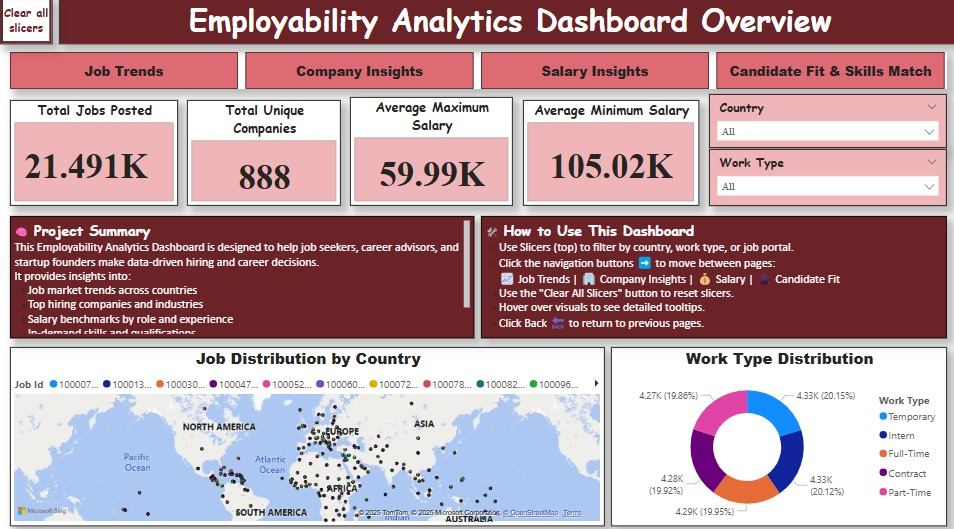
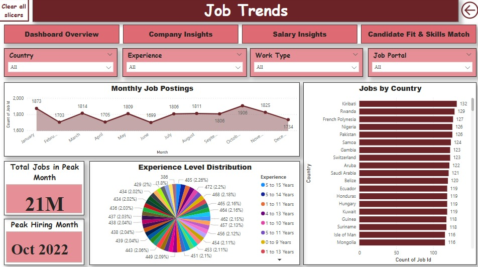
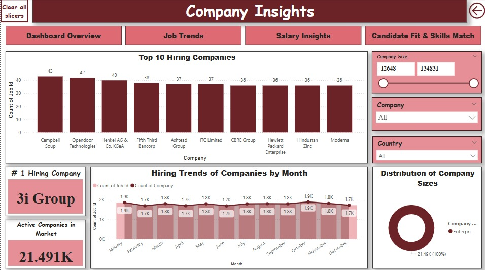
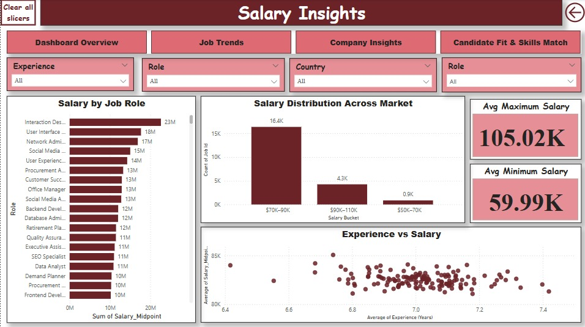
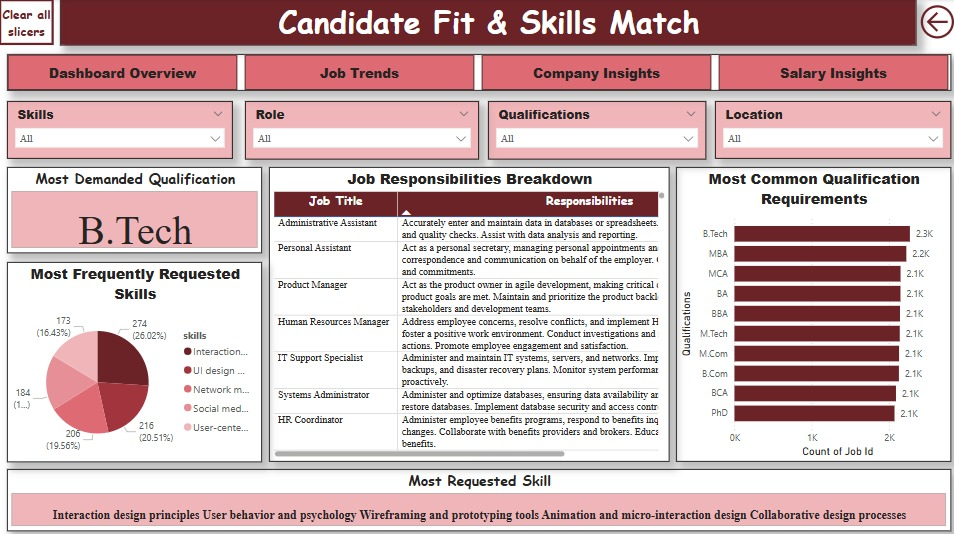

# 🌟 Employability Analytics Dashboard – Team 18

> A Power BI Dashboard designed to help startup founders and career advisors make data-driven hiring decisions with real-time insights into job trends, salaries, skills, and qualifications.

---

## 📚 Table of Contents

- [📘 Project Description](#-project-description)
- [📊 Dashboard Preview](#-dashboard-preview)
- [💡 Key Features](#-key-features)
- [🗂️ Project Structure](#-project-structure)
- [👨‍💻 How to Use & Contributors](#-how-to-use--contributors)
- [📄 License](#-license)

---

## 📘 Project Description

This Employability Analytics Dashboard was developed as part of the **Master’s Research Project (MRP)** at **Saint Louis University**, under the mentorship of **Professor Maria Weber**, for the course **IS-5960**.

Startups often face hiring challenges like budget constraints, rapidly changing role demands, and talent shortages. This dashboard helps streamline recruitment strategies by providing:

- Job market distribution by country  
- Hiring trends over time  
- In-demand skills and qualifications  
- Salary benchmarks by job role and experience  
- Candidate fit insights using real job data

---

## 📊 Dashboard Preview

### 🔹 Dashboard Overview


### 🔹 Job Trends


### 🔹 Company Insights


### 🔹 Salary Insights


### 🔹 Candidate Fit & Skills Match


---

## 💡 Key Features

- 🌍 Country-wise Job Distribution  
- 🧠 Experience-Level Insights  
- 📅 Monthly Job Postings Tracker  
- 💰 Salary by Role & Experience  
- 🧾 Qualification and Skill Frequency  
- 🎛️ Slicers for dynamic filtering (country, role, work type, portal)

---

## 🗂️ Project Structure

```plaintext
startup-employability-dashboard/
│
├── PowerBI_Dashboard.pbix            # Power BI file with full dashboard
├── README.md                         # Project documentation
├── DashboardOverview.jpeg            # Screenshot of Dashboard Overview
├── JobTrends.jpeg                    # Screenshot of Job Trends
├── CompanyInsights.jpeg              # Screenshot of Company Insights
├── SalaryInsights.jpeg               # Screenshot of Salary Insights
├── CandidateFit.jpeg                 # Screenshot of Candidate Fit page
└── data/
    └── Team18_Data.xlsx              # Cleaned and validated dataset used
```

---

## 👨‍💻 How to Use & Contributors

### 🔧 How to Use the Dashboard

1. Download the repository and open the `.pbix` file in **Power BI Desktop**
2. Use available **slicers** to filter data by:
   - 🌎 Country  
   - 💼 Job Role  
   - 👤 Experience Level  
   - 🏢 Work Type / Portal  
3. Navigate through dashboard tabs:
   - **Overview** – Summary metrics and global distribution  
   - **Job Trends** – Time-based hiring analysis  
   - **Company Insights** – Top hiring firms & activity  
   - **Salary Insights** – Role-based salary range comparison  
   - **Candidate Fit** – Role expectations, skills, and qualifications  
4. Hover over visuals to explore insights via **tooltips**  
5. Use the **“Clear All Filters”** button to reset slicers anytime

---

### 👥 Contributors – Team 18

| Name                    | Contribution Area                     |
|-------------------------|----------------------------------------|
| Sai Tharun Kasetti      | Data Cleaning, Integration & Logic     |
| Sunil Kasu              | Dashboard Visual Design & Layout       |
| Manne Jeswanthi         | Requirement Mapping & Traceability     |
| Santhoshi Biradar       | Testing, Feedback, Data Verification   |
| Shiva Kumar Bolishetti  | User Interface Design & Storyboarding  |
| Harika Manukonda        | Documentation & Final Presentation     |

---

## 📄 License

This dashboard was created exclusively for educational and academic use under the guidelines of **Saint Louis University’s ORLD 5960 – Master’s Research Project**.  
All rights reserved © 2025 Team 18.
