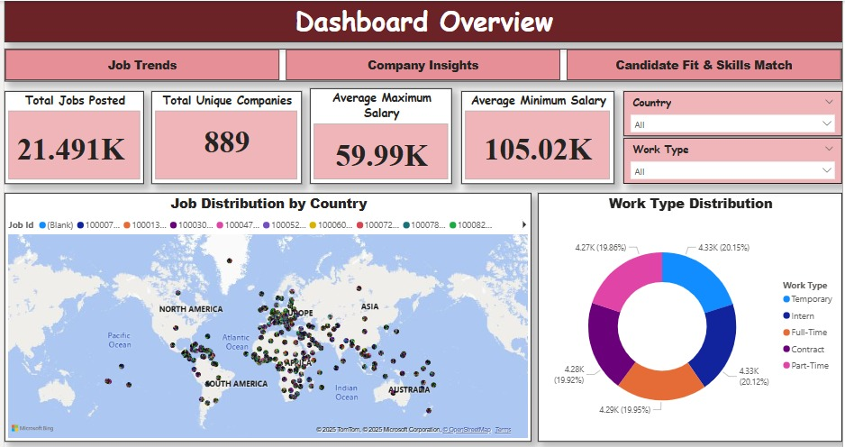
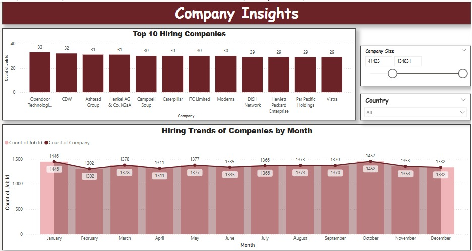
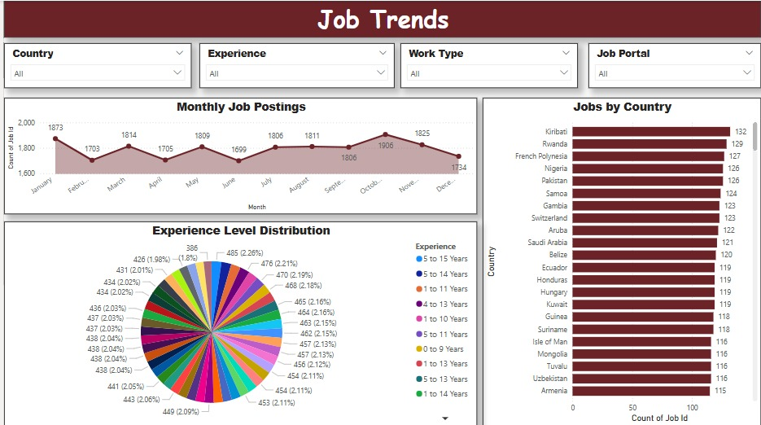

# MRP_Dashboard
# Employability Analytics Dashboard for Startups
> A Power BI dashboard to help startup founders make informed, data-driven hiring decisions with real-time insights into job trends, salary benchmarks, skill demands, and workforce dynamics.

## 📘 Project Description

Startups often struggle with hiring due to limited budgets, fast-changing markets, and a lack of clear data. This dashboard was built to empower startup founders and career advisors with actionable insights into job postings, candidate fit, salary ranges, and global hiring demand. The goal is to streamline recruitment, optimize compensation strategies, and support data-driven decision-making.

This project was developed as part of the Master's Research Project (MRP) at **Saint Louis University** under the mentorship of **Professor Maria Weber**.

## 📊 Dashboard Preview

### 🔎 Dashboard Overview


### 🏢 Company Insights


### 📈 Job Trends



## 📚 Table of Contents
- [Features](#-features)
- [Installation](#-installation)
- [Usage](#-usage)
- [Project Structure](#-project-structure)
- [Contributors](#-contributors)
- [License](#-license)

## 🚀 Features

- 🌐 Job Distribution by Country
- 🏢 Top Hiring Companies by Count
- 📆 Monthly Job Postings Visualization
- 🧠 Experience Level Distribution
- 💼 Salary Benchmarking (Min/Max Salary)
- 🔍 Filter by Country, Experience, Work Type, Portal
- 📊 Work Type and Company Size Distributions

## 🛠 Installation

To run the project locally:

```bash
git clone https://github.com/santhoshibiradar/startup-employability-dashboard.git
cd startup-employability-dashboard
